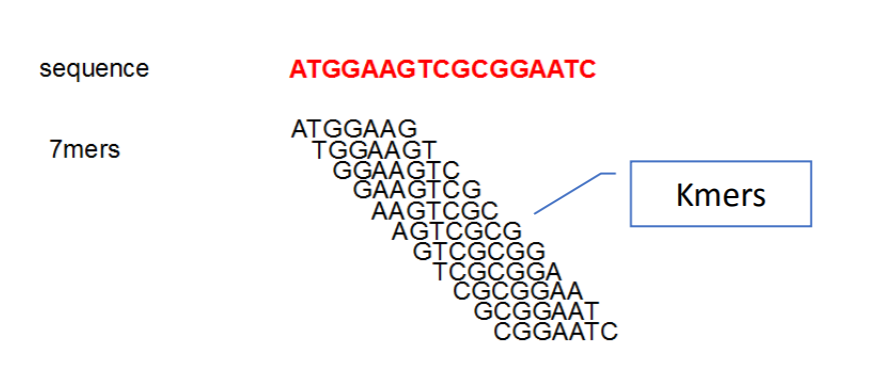
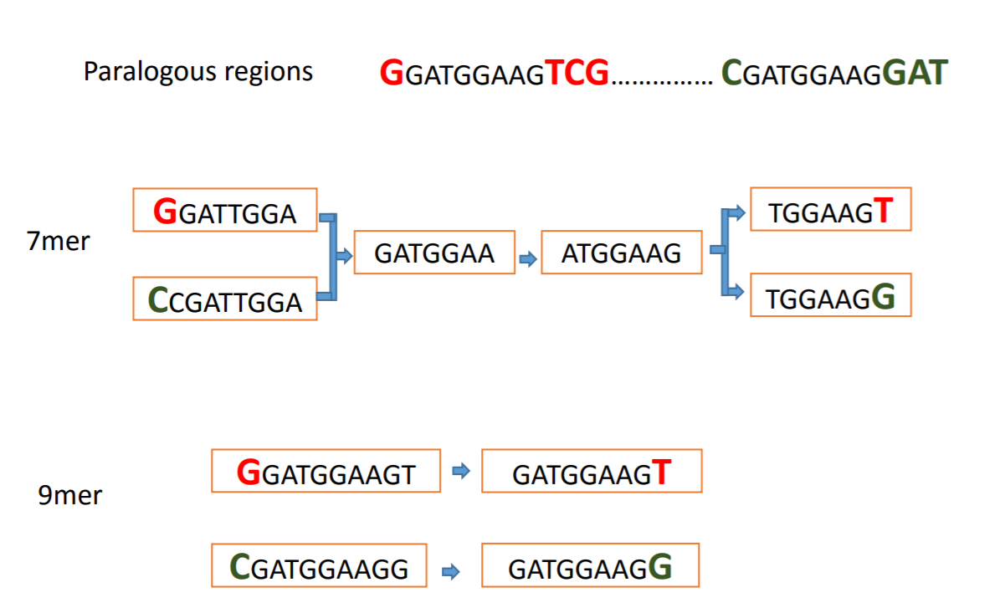
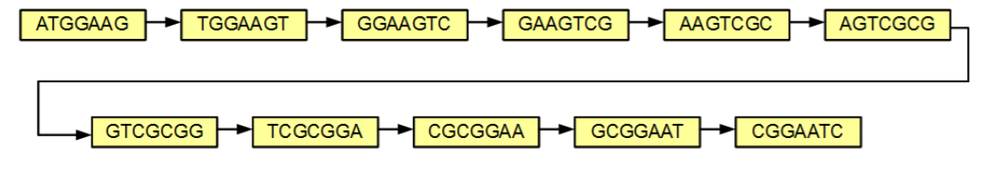
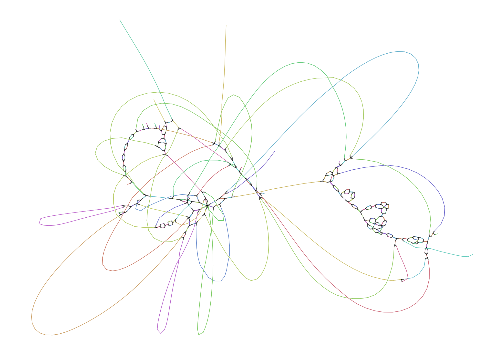
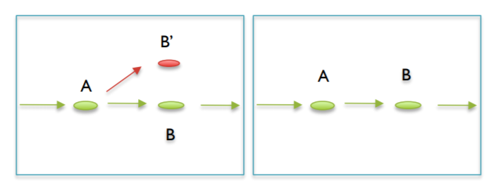
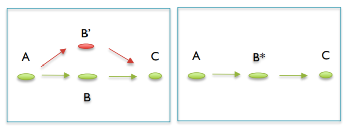
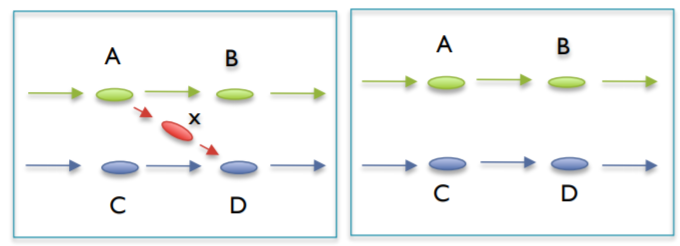
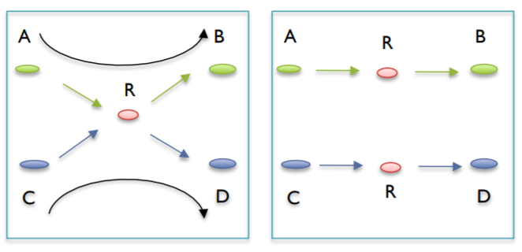
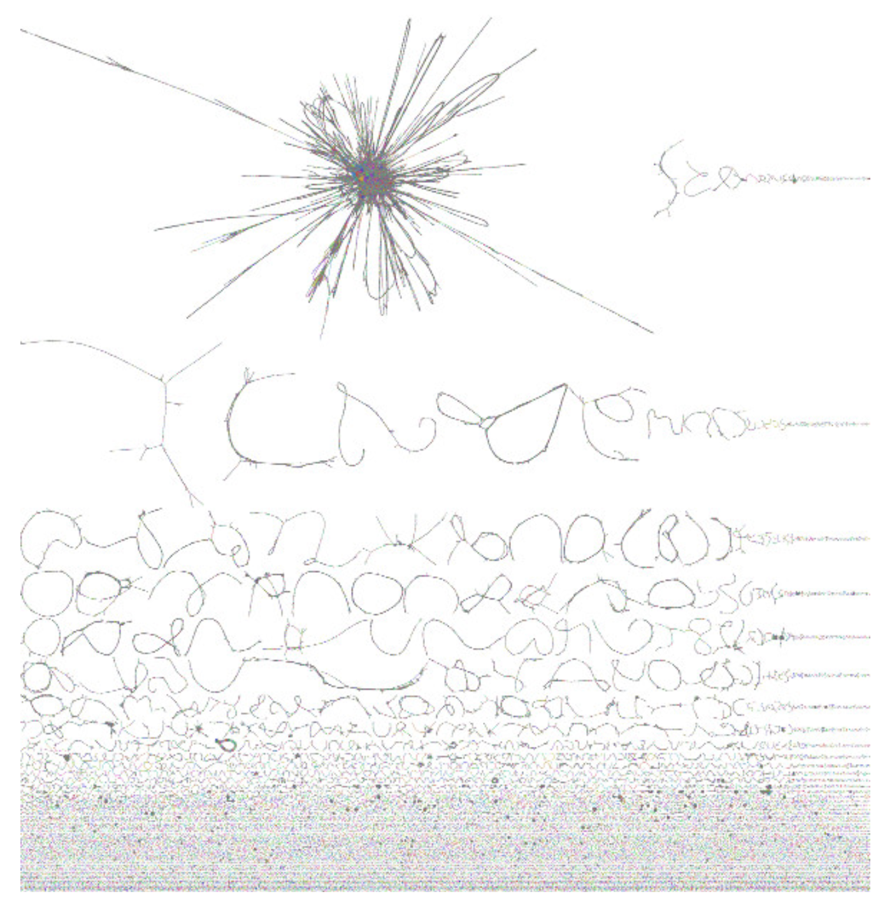

Assembly
========

What is Assembly?
-----------------
Assembly is simply the process of building contigs (longer sequences)
from your raw read data. This is generally accomplished now with a 
de bruijn graph. I would like to make a distinction in terminology 
here as well. In using software and listening to other talk you may 
hear the term scaffold. Though some people may use contig and scaffold
interchangeably, they are NOT the same thing. A scaffold consists of contigs
and gaps, in other words it is an ordered series of contigs with a determined
order. This is just something to be aware of.

De Bruijn Graphs
----------------
This will be a basic introduction to De Bruijn Graphs. It will cover how the graphs 
work with one genome and then how this can be applied to a metagenome.

First a note on k-mer lengths. These graphs rely on k-mers to assembly contigs. That
being said you can choose any length of k you want in theory. Many have presets that 
assemble on a range of k-mer lengths. There is one rule to the length of K though. This
rule is that the length of K MUST BE ODD. This idea comes from the fact that an even k-mer
can end up being the reverse compliment of itself or is palindromic. These sequences make
the resolution of the graph difficult and by picking and odd value for k you can eliminate 
the occurrence completely.

There are four major steps to assembly with De Bruijn graphs:

1. Determine k-mers of each read
^^^^^^^^^^^^^^^^^^^^^^^^^^^^^^^^^
First each read is broken down into its consecutive kmers

Typically this is done over a range of k-mer lengths because it can help resolve parts of 
the genomes for example in the following image using a kmer length of 7 creates an ambiguous 
section of the graph from two sections of the genome while using a 9-mer resolves the section into
its two separate parts.

2. Construct the Graphs
^^^^^^^^^^^^^^^^^^^^^^^^^^
Once the kmers are determined they can be arranged in a graph where nodes(holds kmers) are connected if the 
kmers in the nodes have an overlap of k-1 with each other. in a simple graph where each k-mer only appears
in a genome exactly once, like in the first image of the previous sections, the graph would look something like 
this:

The above graph is extremely simple. An actual graph is extremely complex even for a single species. For example,
the following is a graph for the genome of e. coli:

As you can see, it it much more complex and there are major loops and bubbles and other separate pieces from this 
assembly

3. Graph Simplification
^^^^^^^^^^^^^^^^^^^^^^^^^^
As shown previously, these graphs can become very complex very quickly. Some of this complexity comes from 
biological reasons while other come from sequencing errors. This section explains some of the complexities 
that appear and how they are dealt with to get a cleaner more accurate assembly. You may have encountered some
of these terms in meetings or readings.

A. Trim Tips
################
Tips are protrusions from the graph that end in a dead-end. In other words, these protrusions do not loop back in.
Tips appear when there are errors towards the ends of the reads. These are simply simply removed. Typically they 
are removed according to a length threshold and the tip will be kept if it is longer than the threshold.

B. Pop/Merge bubbles
################
Bubbles are areas where a graph deviates by comes back after a short length. Bubbles can appear for many reasons.
They can appear from a random overlap of two tips(typically seen in high coverage data sets), an error in the middle
of a read, or due to polymorphisms of the genome. Popping/Merging bubbles can occur in many ways, and it uses many metrics
such as coverage to decide the correct path or merge the junction.

C. Clip Short Low Coverage nodes
#################################
This is mainly done to remove chimeric links. These chimeric links are not bubbles or tips, and they connect to longer
genuine contigs to each other in ways they they should not be connected. They can be the overlap of two tips, an incorrect
read match to an area of the genome it does not belong in, or an actual sequenced chimeric read. These are simply removed.

D. Correcting Ambiguous Paths (X-cuts)
#######################################
some places appear where contigs may share a short section of sequence but aside from that they are independent of each other.
Imagine an X where the intersection is the overlapping sequence. These are split into two independent contigs and each of them 
get the overlapping sequence.

4. Find a Path Through the Graph
^^^^^^^^^^^^^^^^^^^^^^^^^^^^^^^^^^
Once the graph is cleaned up you can find a path through all the notes to create the contigs. There are multiple solutions to 
finding the path.

5. Application to a metagenome
^^^^^^^^^^^^^^^^^^^^^^^^^^^^^^^
All of the same concepts as above apply. However the graph will essentially section itself off into different genomes. Highly divergent
species will appear to separate while highly similar ones will become intertwined with each other. An example visualization of a metagenome
can be seen below:

Assembly Considerations
---------------------------