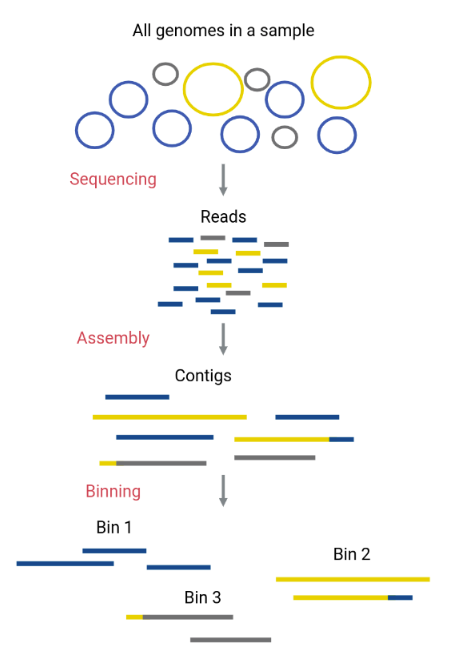
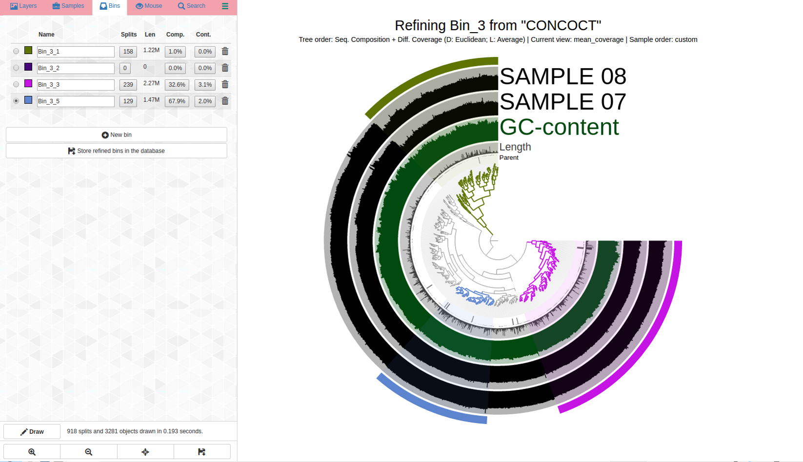

Binning (with CONCOCT and ANVIO)
=======================

This guide will focus on CONCOCT and ANVIO as these are the software we have found to work best in our work.

What is Binning?
-----------------
Binning is the clustering of contigs using coverage information generated from mapping reads to the contigs,
genomic features like GC content and tetra nucleotide frequencies, or a combination of these. Binning can be 
done automatically with software such as concoct, maxbin, metbat, etc. As a note, different binning softwares have
varying levels of success from data set to data set. Binning can also be done completely manually with something 
like anvio or vizbin. However, even if using an automatic binner such as concoct, a manual refinement
of the produced bins is recommended and can be performed in anvio.

How does CONCOCT work
----------------------
CONCOCT ( https://arxiv.org/abs/1312.4038 ) is an automatic binner that , through our testing and observation, seems to 
work well overall in most samples. It uses a combination of tetranucleotide frequencies and differential coverage of contigs
across samples. This informationed is combined into a matrix that is dimmensionally reduced using a PCA that keeps atleast
90% of the variance. The bins are then clustered using a Gaussian Mixture Model. CONCOCT tries to be flexible by allowing you 
to estimate the number of genomes in the sample 3-4x higher than what is actually there and programmatically bringing that number
down in its final output. 

The steps to run CONCOCT
---------------------
The steps to run concoct are as follows:
1. Generate the coverage table from all of the bams created from mapping reads to the contigs you are binning
2. Cut up contigs that are longer than 10kb into 10kb chunks
3. run clustering
4. merge cutup contigs in their bins
5. create fasta files of bins

Deviation from defaults
------------------------
As mentioned above CONCOCT attempts to bring the bin estimation value down from an overestimated value, 400 by default.
We bypass this by forcing this estimated bin count to be extremely low. Similarly to the logic and approach used by the
meren lab. We estimate the number of genomes in an assembly by counting the occurances of a set of  SCGs from GTDB and setting
the parameter (-c clusters) to half of the estimated bin count. Doing this forces bins to be made with multiple populations in them.
The goal is to produce less bins that have less splitting that you can pull apart by manual refinement with ANVIO. It is easier
to pull bins apart than it is to put them back togethor.

Bin Refinement with ANVIO
-------------------------
ANVIO allows you to visualize your bin along with all of the information used to make that bin in concoct. It shows you the differential
coverage of each contig as well as its GC content and taxonomy in a sorted view. This allows you to easily see distint bins to separate.
It also provides real time completion and contamination estimates as you work.

A detailed guide can be found here of many things you can do in anvio https://merenlab.org/tutorials/infant-gut/

Assessing bin quality
----------------------
To asses how complete the bins generated by binning, we use CheckM (https://ecogenomics.github.io/CheckM/#:~:text=CheckM%20provides%20a%20set%20of,copy%20within%20a%20phylogenetic%20lineage.).
CheckM uses SCGs to estimate how complete the bins are by seeing how many appear in the bin and estimates the contamination of the bin by counting how many times each SCG occurs in the bin. It 
also provides a strain het metric that is a good indicatior of where that contamination is coming from if it is present. If the strain het value is closer to 100% it indicates that the contamination
is more than likely from a similar species. This metric can give you an idea of if you are able to refine a bin further or if the contamination is not easily removed. While checkm provides useful
metrics and information about the bins you refine, it should not be taken at face value. You may find, by looking at the bin in anvio, that a bin with high completion and low contamination is just a 
collection of contigs with no real pattern and something that can ultimately be thrown away, or contigs in a bin with no SCG on them that do not belong that you would not see in just a checkm results
table. It is always recommended to visually inspect these bins.

Dereplicating bins
-------------------
In most metagenomic analysis you will produce multiple assemblies. To create a set of MAGs for genome centric analysis accross samples, these bins will need to be merged. However, as you can imagine, 
if these samples were similar to begin with, the set of MAGs you produce will contain the same MAG in many of the samples. In order to merge them, dereplication is recommended. This is removing copies
of the sample MAG from the combined set. This combats problems with competative mappings and things like estimated abundance of a MAG in a sample more of which can be read about here: https://journals.asm.org/doi/10.1128/mSphere.00971-19

A tool to accomplish this, and its documentation, can be found here: https://github.com/jtevns/Pairwise_Dereplication 

