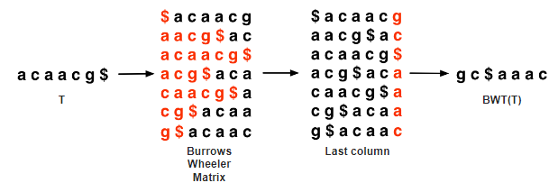
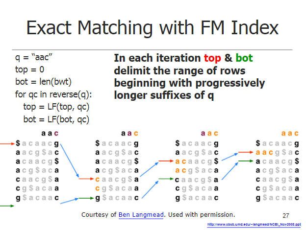

Mapping
========

What is Mapping?
-----------------
Mapping is the act of aligning reads to a reference to find out the location of where these reads are in ther reference. In this context it is
to contigs that make up a MAG. Mapping is an extremely important part of bioinformatic methods and 
part of many analyses. Some examples include:

1. All vs all mapping to generate coverage profiles of contigs for binning
2. Competitive mapping to MAGs to estimate relative abundance
3. Mapping to genomes to find snvs across samples.

How it Works
-------------
There are many algorithms used in short read alignment to references, if you want to look at them all
you can read this paper: link[https://www.ncbi.nlm.nih.gov/pmc/articles/PMC5425171/]

Although there are many algorithms, this guide will focus on the BWT (Burrows-Wheeler Transform) based
tools BWA-MEM and Bowtie. These are the most commonly used mapping softwares and can be used in most applications.

The Burrows-Wheeler Transform
------------------------------
The transormation steps is as follows:

 1. Take the reference string you want to search against and add a $ to the end of it. This allows us to know what the end of the original string was and rotation to 
    determine permutations.
 2. Create a matrix of all possible  rotations of the string and sort them alphabetically
 3. Take the last column of the matrix. This is your BWT of your reference.

Mapping to the BWT/FM index
----------------------------
1. Create the index of the reference using the BWT
2. for each read to map:
    a. for each base in the reversed string
        - compute functions that tells you the start and end of a range of rows of the index this base occurs and where to look for the next base
        - if the range is length 0 there is not an exact match

The above explanation is for exact matching to get an idea of how the software works. Finding mismatches involves backtracking which you
can look into more if you so choose.

What data comes from Mapping
-----------------------------
Mappers return the location in the reference where reads aligned. This is in sam format. However you should always prefer to work with bam files
which are simply the compressed version of a sam file. The sam format contains the following:

Sofware for mapping outputs
-----------------------------
Almost everything you could possibly want to do and need to do with a sam/bam file can be done with samtools (link[http://www.htslib.org/doc/samtools.html]). 
However some niche programs exist like pileup.sh from bbtols that generates a pileup from a bam file (though you could also do this in samtools).

