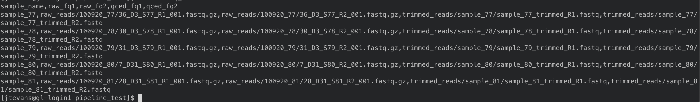

=============================================
Metagenomics Pipeline, From raw reads to bins
=============================================

Basic Pipeline Structure
========================
Currently, this pipeline covers:

- Quality control
 - adapter trimming
 - quality trimming
- Assembly with MEGAHIT
 - single sample assemblies
 - co-assemblies
- Mapping with bwa
 - can map multiple samples to one reference
 - generates sorted bams
- Binning with concoct
 - runs the multithreaded version of concoct
 - checkm (BROKEN)
 
The pipeline is a large Snakemake workflow that calls on different sets of rules for each of the above steps based on teh requested output files. It aims to be modular so that any step can be run without performing the step that comes before it (ie. run mapping on something that was not QCed with this pipeline). To acomplish this the pipeline is controlled by config files and a few csv files that keep track of important information like Sample names and their corresponding files. The pipeline will also submit a single slurm job for each rule run without the need to write your own slurm scripts.
 
The Files
=========
The Main Config File
----------------
The config file is the main file for control. Here you tell the pipeline what mode you want to run in, information for your slurm account, where the inportant csv files are, how you want things run, etc. 

The default main config file looks like: 

.. code-block:: yaml 
    ######################################
    # Available workflows, 
    # QC, Mapping, Assembly, Binning
    # Change mode: to the above value you
    # want to run
    ######################################
    mode:

    ##########################################
    # Basic options, These will be run before
    # any of the above workflows. Change to True
    # to run these steps
    ##########################################
    working_dir: "./"
    container: "docker://continuumio/miniconda3:4.4.10"

    ##########################################
    # Workflow Params, Each Workflow has Options
    # that can be initiated here. Defaults are 
    # filled in below
    ##########################################
    QC_Params:
    csv_info: ".test/fastqs.csv"

    Assembly_params:
    csv_info: ".test/assems.csv"
    scheme: "assembly_scheme.yaml"

    Mapping_params:
    csv_info: ".test/mappings.csv"
    scheme: "mapping_scheme.yaml"

    Binning_params:
    scheme: "binning_scheme.yaml"

This is the bare minimum required inputs to run this pipeline in full. Will add more details about advanced options as they are tested.

The CSV Files
-------------
There are three csv files that are used by the pipeline to supply what files you want to run through it. These include the fastq, assembly, and mapping csv files. It is important to note that the names you use for samples and assemblies are what they will be known as to the pipeline and will be what the outfiles use in their naming scheme. It is also important to note that the column names in your file must match the names in these examples. LETTER CASE MATTERS.
The sample name column here cannot be only numbers with an _. For example, 1110009_994 will not work for some reason.
- The fastq csv:
    The fastq csv maps sample names to the raw reads paths as well as the qced fastq files for mapping and assembly later. the qced reads that run through this 
    pipelines qc will be in the form trimmed_reads/{sample}/{sample}_trimmed_R1.fastq where {sample} is the first column of this csv. The full table can be populated before 
    the run. To run qc you only need sample_name, raw_fq1, and raw_fq2. To run assembly and Mapping, you need sample_name, qced_fq1, and qced_fq2. 

    .. code-block:: csv
        sample_name,raw_fq1,raw_fq2,qced_fq1,qced_fq2
        sample_77,raw_reads/100920_77/36_D3_S77_R1_001.fastq.gz,raw_reads/100920_77/36_D3_S77_R2_001.fastq.gz,trimmed_reads/sample_77/sample_77_trimmed_R1.fastq,trimmed_reads/sample_77/
        sample_77_trimmed_R2.fastq
        sample_78,raw_reads/100920_78/30_D3_S78_R1_001.fastq.gz,raw_reads/100920_78/30_D3_S78_R2_001.fastq.gz,trimmed_reads/sample_78/sample_78_trimmed_R1.fastq,trimmed_reads/sample_78/
        sample_78_trimmed_R2.fastq
        sample_79,raw_reads/100920_79/31_D3_S79_R1_001.fastq.gz,raw_reads/100920_79/31_D3_S79_R2_001.fastq.gz,trimmed_reads/sample_79/sample_79_trimmed_R1.fastq,trimmed_reads/sample_79/
        sample_79_trimmed_R2.fastq
        sample_80,raw_reads/100920_80/7_D31_S80_R1_001.fastq.gz,raw_reads/100920_80/7_D31_S80_R2_001.fastq.gz,trimmed_reads/sample_80/sample_80_trimmed_R1.fastq,trimmed_reads/sample_80/
        sample_80_trimmed_R2.fastq
        sample_81,raw_reads/100920_81/28_D31_S81_R1_001.fastq.gz,raw_reads/100920_81/28_D31_S81_R2_001.fastq.gz,trimmed_reads/sample_81/sample_81_trimmed_R1.fastq,trimmed_reads/sample_8
        1/sample_81_trimmed_R2.fastq 

- The Assembly csv:
 The Assembly csv keeps track of the assembly paths once assembly has completed. This file is used for binning and mapping when the assembly is 
 is being used as the reference. The name refers to whatever you named your assembly, and the path to the final contigs from megahit.

 .. code-block:: csv
    name,path
    sample_77,assemblies/sample_77/Megahit_meta-sensitive_out/final.contigs.fa
    sample_78,assemblies/sample_78/Megahit_meta-sensitive_out/final.contigs.fa
    sample_79,assemblies/sample_79/Megahit_meta-sensitive_out/final.contigs.fa
    sample_80,assemblies/sample_80/Megahit_meta-sensitive_out/final.contigs.fa
    sample_81,assemblies/sample_81/Megahit_meta-sensitive_out/final.contigs.fa

- The Mapping csv:
 The Mapping csv keeps track of the path to the bam files and the reference and sample that were used to create them. The firs column being the reference you mapped
 to and the second being the name of the sample being mapped. This file is used by the binning workflow to create coverage files.
 
 .. code-block:: csv
    ref,sample,bam
    sample_77,sample_77,mapping/sample_77/sample_77_mapped_sorted.bam
    sample_77,sample_78,mapping/sample_77/sample_78_mapped_sorted.bam
    sample_77,sample_79,mapping/sample_77/sample_79_mapped_sorted.bam
    sample_77,sample_80,mapping/sample_77/sample_80_mapped_sorted.bam
    sample_77,sample_81,mapping/sample_77/sample_81_mapped_sorted.bam
    sample_78,sample_77,mapping/sample_78/sample_77_mapped_sorted.bam
    sample_78,sample_78,mapping/sample_78/sample_78_mapped_sorted.bam
    sample_78,sample_79,mapping/sample_78/sample_79_mapped_sorted.bam
    sample_78,sample_80,mapping/sample_78/sample_80_mapped_sorted.bam
    sample_78,sample_81,mapping/sample_78/sample_81_mapped_sorted.bam

The Scheme Files
----------------
The assembly, mapping, and binning workflows require these yaml files. They are used to include multiple samples for co-assembly, mapping multiple samples to the same reference, and indicating what mappings to include when computing coverage for binning.
All of these follow the same scheme. The first entry for assembly is the name of the assembly and the indented entries under it are all the samples you want to be
part of that assembly. The entries must have the same name as the samples in the fastq csv as that is where the path to the fastq will be pulled from.
For the mapping file the first entry is the reference you are mapping to that must match to an assembly in the assembly.csv file and the entries under it
are all of the samples you want to map to it that must again match to the fastq.csv file. For binning the first entry is the assembly you want to bin and the entries under it are the
mappings you want to include (this may be exactly the same as the mapping scheme assuming you map all vs all for binning).

.. code-block:: yaml 
    sample_77:
    - sample_77
    - sample_78
    - sample_79
    - sample_80
    - sample_81
    sample_78:
    - sample_77
    - sample_78
    - sample_79
    - sample_80
    - sample_81

Running The Pipeline
====================

TEMPORARILY THE SNAKEMAKE COMMAND MUST BE RUN IN A SLURM SCRIPT

First I get a copy of the pipeline in the directory I am working in and I created a raw_reads reads directory. The reads directory has
a directory for each sample and the r1 and r2 for each. There is no need to unzip them as the first qc step can read zipped files.

I then make the fastq.csv file and populate it fully with the naming schemes mentioned above.

I then take a copy of the config.yaml file from above and put QC as the mode then to run the pipeline I execute the following

.. code-block:: bash
    snakemake -s Metagenomics-Workflow/Snakefile --cores 36 --use-conda

This will take care of software dependencies and run qc on each row in your fastqc.csv

Once QC is done simply change the mode in the config to assembly to assemble and create your assembly scheme file. Mine is below:

.. image:: ../images/Screen Shot 2021-02-02 at 10.43.59 PM.png

The above scheme makes single sample assemblies.

Again run the same snakemake command as above. 

Once assembly is done you will need to create the assembly_info.csv file from the assembly output. Mine is below.

.. image:: ../images/Screen Shot 2021-02-02 at 10.41.52 PM.png

Now it is time to map to the assembly. First change the mode to Mapping. Then create the mapping_scheme file like mine below:

.. image:: ../images/Screen Shot 2021-02-02 at 10.43.04 PM.png

The above scheme does an all vs all mapping for this data.

run the snakemake command like above and wait for it to finish. Once done create your mapping_info.csv file like mine below.

.. image:: ../images/Screen Shot 2021-02-02 at 10.42.34 PM.png

When mapping is done, all that is left to do is bin. You can now make the binning_scheme file. In my case it is an exact copy of 
my mapping_scheme file above. 

Run the snakemake command one last time and you should end up with some fasta bins. for each assembly.

Note: checkm doesnt work currently using conda envs
