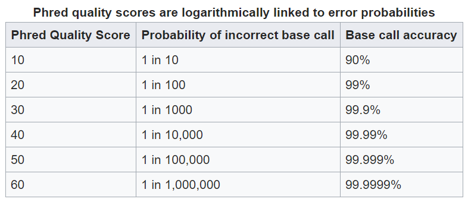
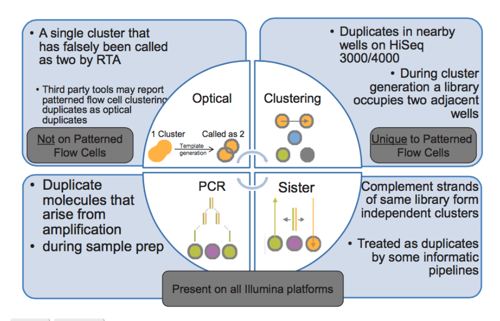
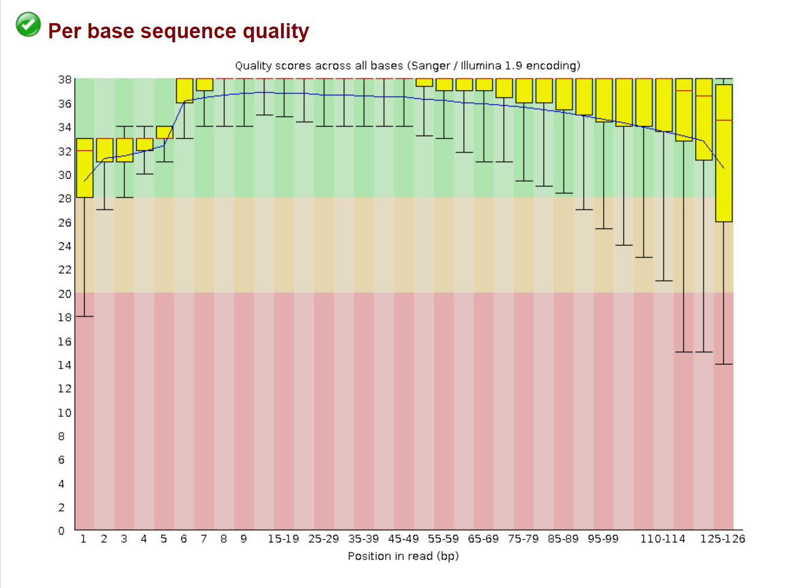
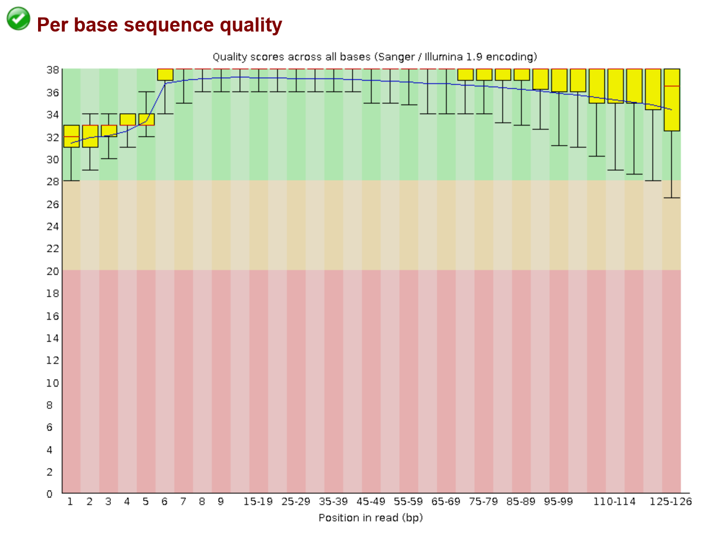

Quality Control
===============
Once your samples have been sequenced some quality control measures must be taken.

The major steps are:
    - adapter trimming
    - low quality base trimming
    - dereplication of raw reads

Basic Example Workflow
----------------------
raw reads -> finding adapters -> adapter trimming -> poor base trimming -> dereplication -> read pairing (if paired end)

Trimming Adapters
-----------------
Adapters are synthetic sequences added to the beginning and ends of reads for sequencing. Because tehse sequences are not part of your experimental 
sample it is imiperitive that they are removed. If they are not completely removed they can contaminate you assemblies and appear downstream in contigs 
making results from you analysis not make sense and also useless.

Removing Poor Quality Bases
------------------------------
A result of the sequencing technology is that bases towards the beginning and ends of reads suffer from a loss of quality. Quality in this cacse refers 
to the confidence of the base call. The quantitative measure of the quality of a base is its phred score. 

A general overview of phred scores:

this quality information is found in fastq files which is why these are the files you will start with.

Removing Replicate Reads
-------------------------
Assuming you are doing shotgun sequencing, no read should have an replicates (exact matches to itself). Therefore if there are exact matches present 
in the fastq files they need to be removed. Replicates can come from pcr steps in which the replicates appeared during library preporation or they
can be optical duplicates which appear during the actual sequencing. If not removed, they can cause issues later in your assembly. 

Understanding Your Read Data
------------------------------
Now that we have a basic understanding of the steps of QC you might be asking yourself "Okay, but how do I know my reads need to be QCed or 
if the QC succeeded?". The easiest way is by using a software called fastqc which provides a visual inspection for your data. 

FastQC creates a summary of your reads BASED ON A SUBSET of your raw data. It proved 3 levels of quality for each of its summaries:
    - passed : your reaads "pass" the quality test
    - warning : there might be something wrong with your reads based on the test
    - fail : your reads failed the test and action must be taken

FastQC levels should be taken with a grain of salt!!!!

Not all sequencing data is created equal. They serve different purposes. For example in DNA-seq you do not expect read replicates in the data. 
However in RNA-seq the replicates ARE your data. Therefore the tests are not an end all be all. In the next sectionas we will use and actual metagenomics
 experiment fastqc report to explain each test and how a raw data set compares to a QCed set.

FastQC Test Information
-----------------------------
Previously I have stated general patterns of sequencing data such as poor bases and the beginning and ends of reads. In this section you can see the
visual representations of this as well.

Read Quality Plot
^^^^^^^^^^^^^^^^^

This is simpy a boxplot where the y-axis is the quality score and the x is the postion along the read.

The first image is before QC:

Here you can easily see that the quality of the base calls in the beginning and end of the read are significantly lower than the quality of the base calls in 
the middle of the read.

This visualization is useful for evaluating the trimming of poor bases. Ideally you would try to bring each of the box plots into the green section of the graph. 
This is usually easy to do, but in some cases it may be hard and removing too many of the poor base calls will be detrimental to your data set

Here is the same sample after removing poor quality bases:

As you can see the vast majority of reads fall in the green along most of the read except for the very end. This is okay and we would be able to move forward.
 
