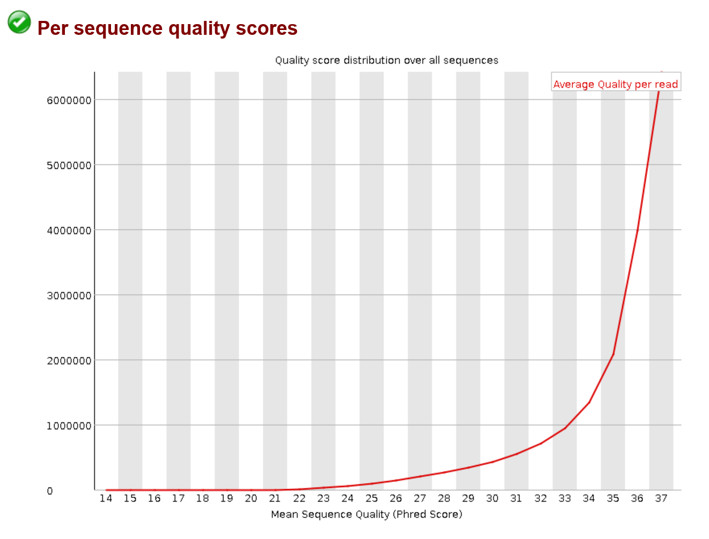
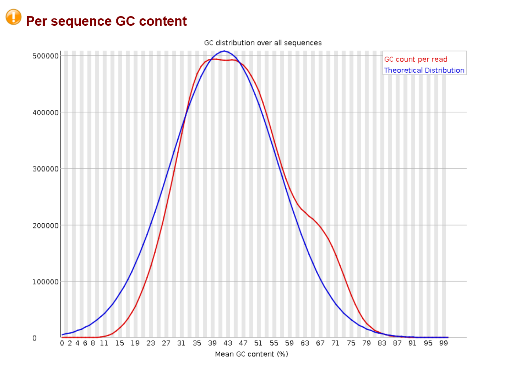
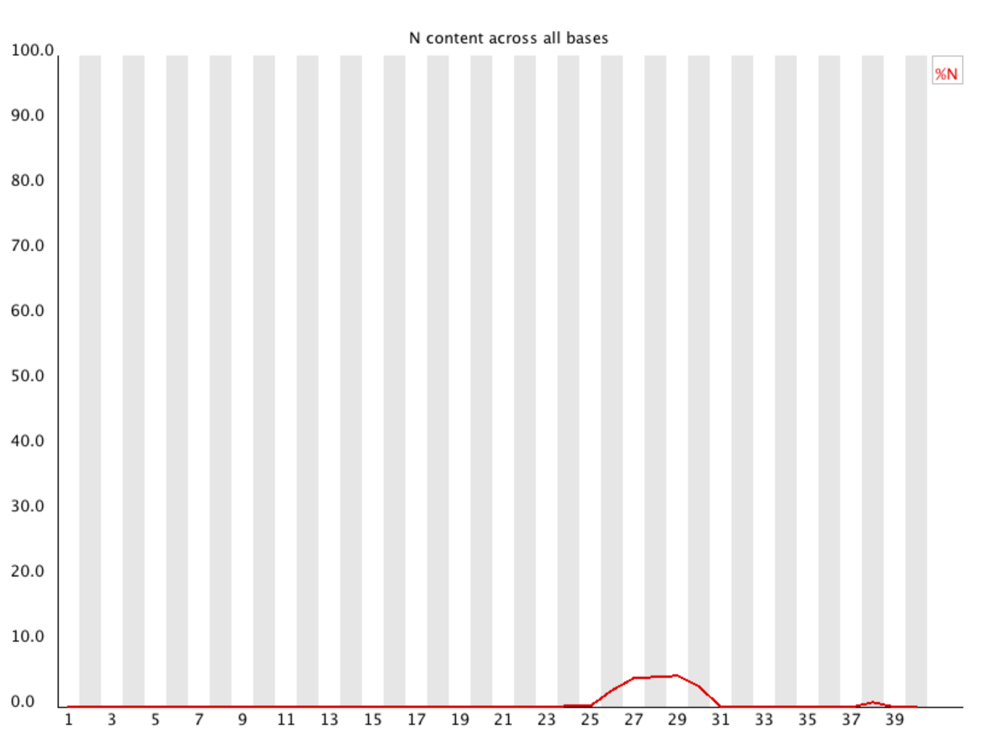
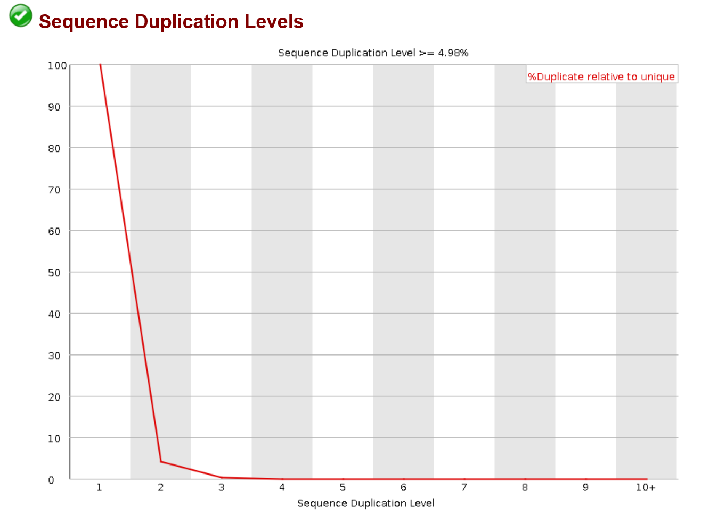

Quality Control
===============
Once your samples have been sequenced some quality control measures must be taken.

The major steps are:
    - adapter trimming
    - low quality base trimming
    - dereplication of raw reads

Basic Example Workflow
----------------------
raw reads -> finding adapters -> adapter trimming -> poor base trimming -> dereplication -> read pairing (if paired end)

Trimming Adapters
-----------------
Adapters are synthetic sequences added to the beginning and ends of reads for sequencing. Because these sequences are not part of your experimental
sample it is imperative that they are removed. If they are not completely removed they can contaminate you assemblies and appear downstream in contigs
making results from you analysis not make sense and also useless. Sequencers are capable of recognizing adapters at the front of sequences and they are usually removed automatically. So this step usually focuses on the ends(right) sides of reads.

Removing Poor Quality Bases
------------------------------
A result of the sequencing technology is that bases towards the beginning and ends of reads suffer from a loss of quality. Quality in this cacse refers
to the confidence of the base call. The quantitative measure of the quality of a base is its phred score.

A general overview of phred scores:

.. image:: ./images/Screenshot_4.png

this quality information is found in fastq files which is why these are the files you will start with.

Removing Replicate Reads
-------------------------
Assuming you are doing shotgun sequencing, no read should have an replicates (exact matches to itself). Therefore if there are exact matches present
in the fastq files they need to be removed. Replicates can come from pcr steps in which the replicates appeared during library preparation or they
can be optical duplicates which appear during the actual sequencing. If not removed, they can potentially cause issues later in your assembly, and 
later in analysis when using mapping based approaches for determining things like relative abundance.

.. image:: ./images/Screenshot_6.png

Understanding Your Read Data
------------------------------
Now that we have a basic understanding of the steps of QC you might be asking yourself "Okay, but how do I know my reads need to be QCed or
if the QC succeeded?". The easiest way is by using a software called fastqc which provides a visual inspection for your data.

FastQC creates a summary of your reads BASED ON A SUBSET of your raw data. It provides 3 levels of quality for each of its summaries:
    - passed : your reads "pass" the quality test
    - warning : there might be something wrong with your reads based on the test
    - fail : your reads failed the test and action must be taken

FastQC levels should be taken with a grain of salt!!!!

Not all sequencing data is created equal. They serve different purposes. For example in DNA-seq you do not expect read replicates in the data.
However in RNA-seq the replicates ARE your data. Therefore the tests are not an end all be all. In the next sections we will use and actual metagenomics
experiment fastqc report to explain each test and how a raw data set compares to a QCed set.

FastQC Test Information
-----------------------------
Previously I have stated general patterns of sequencing data such as poor bases and the beginning and ends of reads. In this section you can see the
visual representations of this as well. This does not include all fastQC tests, only those that are important or interesting.

Read Quality Plots
^^^^^^^^^^^^^^^^^^^^^

This is simply a boxplot where the y-axis is the quality score and the x is the position along the read.

The first image is before QC:

.. image:: ./images/Screenshot_2.png

Here you can easily see that the quality of the base calls in the beginning and end of the read are significantly lower than the quality of the base calls in
the middle of the read.

This visualization is useful for evaluating the trimming of poor bases. Ideally you would try to bring each of the box plots into the green section of the graph.
This is usually easy to do, but in some cases it may be hard and removing too many of the poor base calls will be detrimental to your data set

Here is the same sample after removing poor quality bases:

.. image:: ./images/Screenshot_5.png

As you can see the vast majority of reads fall in the green along most of the read except for the very end. This is okay and we would be able to move forward.

Another read quality plot is below. It probably won't have a drastic change before and after qc it just gives you an idea of the quality distribution
across your sample. So below it just shows that a large number of reads have high avg quality. 

Per Sequence GC Content
^^^^^^^^^^^^^^^^^^^^^^^^

This is an interesting plot, do to it specifically being different in a metagenomics context. Here the plot shows the distribution of GC content 
across reads in the sample. If you were sequencing from one species you would expect a normal distribution, but because of the nature of
metagenomic data, this will most likely not be the case. Different species have different GC content so seeing a non normal distribution is okay.
This again demonstrates why these should be taken with a grain of salt and within the context of what kind of data you have.

Just a note, this image is pretty similar to normal but you can see more extreme deviations from a normal distribution. It will also not really
change after qc.

Per Base N Content
^^^^^^^^^^^^^^^^^^^^

This is a good plot to look at to asses the quality of your reads as well. An N is given to a read if the base could not be determined during
sequencing. You will most likely not see N's. However, it is not uncommon to see N's at the beginning and ends of reads. Trimming will most
likely clean these up for you. If you see a peak above 1% in the middle of the reads, this shows that there was a higher level problem either
at the sequencing stage or before.

You will most likely see no peaks so I will share an image of a plot that would be concerning.

notice the small peak at the very end of the read. This would most likely be okay. However, the large peak more towards the middle COULD 
illustrate a problem in sequencing.

Sequence Duplication levels
^^^^^^^^^^^^^^^^^^^^^^^^^^^^^
This plot allows you to visualize the duplicate reads in your samples. As stated before they can come from many sources but ultimately 
should be removed. You will probably see some duplication at very low values on the x axis. And you may not see a huge change in the
before and after graphs. This is dependent on the method of deduplication though and the definition of a replicate. Some software will 
only remove replicates that are identical on both read one and read two. If you see replication at higher levels on the x-axis make sure 
that those reads are being removed as their duplication level is extremely high (unless this is transcriptomics data)

Overrepresented Sequences
^^^^^^^^^^^^^^^^^^^^^^^^^^^^^
This may be the most important section as it will identify adapter contamination. If you use a trimming software that has a built in list
of adapter sequences there is a chance that the adapters may not be removed. If they are in your data before and after qc they will appear 
here. You cannot move forward until ALL adapters are removed or you will have to start from the beginning and all work you did with the 
contaminated data will be useless. There is not graph here but if there are sequences they will appear in a table and it will tell you an 
adapter name if it was found.

Our QC Workflow Commands and software
-------------------------------------

Optional First: Run fastqc on each fastq:
::
  
  fastqc sample.fastq -o ./

This is not necessary but it would give you an idea of the data before you qc it.

First: Find check raw read files to determine the adapters used. This allows us to not have to worry about specific adapters not appearing
in predefined lists in software. This requires the bbtools suite:
::

   #check 1m reads in both r1 and r2 to determine r1 and r2 adapters and save to file adapters.fa
   bbmerge.sh in1=$(echo *R1.fastq) in2=$(echo *R2.fastq) outa=adapters.fa reads=1m

Second: adapter Trimming with scythe:
::
  
   scythe -a adapters.fa -q sanger -m sample.fastq -o scythe_sample.fastq

For adapter trimming you simply need the fasta file of the adapter and the fastq files. You would run the above command separately on each
one of your fastq files. I recommended the output have an identifier to tell yourself that you trimmed adapters from the file. This output
file will then be used in the next step.

Third: base trimming with sickle:
::
   
   sickle se -t sanger -f scythe_sample.fastq -o sickle_scythe_sample.fastq

As before you would run this command on each fastq for each sample you have. Again, add an identifier to let you know this file has been
trimmed for quality.

Fourth: dereplicate with dereplicate.plot:
::

  perl dereplicate.pl -fq sickle_scythe_sample.fastq -o dedupe_sickle_scythe_sample.fastq

Again, this is run on each fastq

Fifth: Interleve fastq files and turn them to fasta:
::

  perl interleave.pl -fastq -outfmt fasta -rev dedupe_sickle_scythe_sample_r1.fastq -fwd dedupe_sickle_scythe_sample_r2.fastq -o sample_int.fasta

I recommend interleving becouse it serves two purposes. It matches r1 and r2 reads because you can only assemble with reads that have their mate. It also
will make your commands shorter and let you keep a smaller number of files for mapping in later steps.

Lastly: run fastqc like above but on the dedupe_sickle_scythe_sample.fastq this will let you know if your qc was successful and if you should move on
